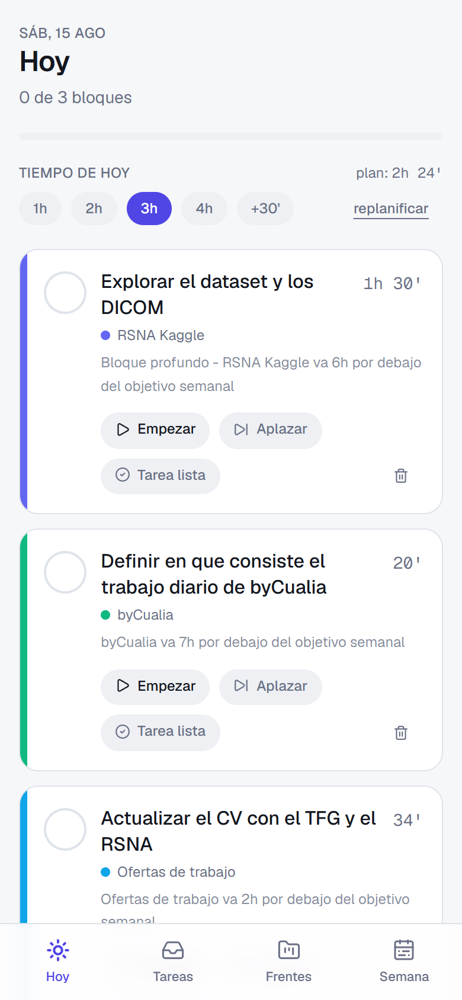
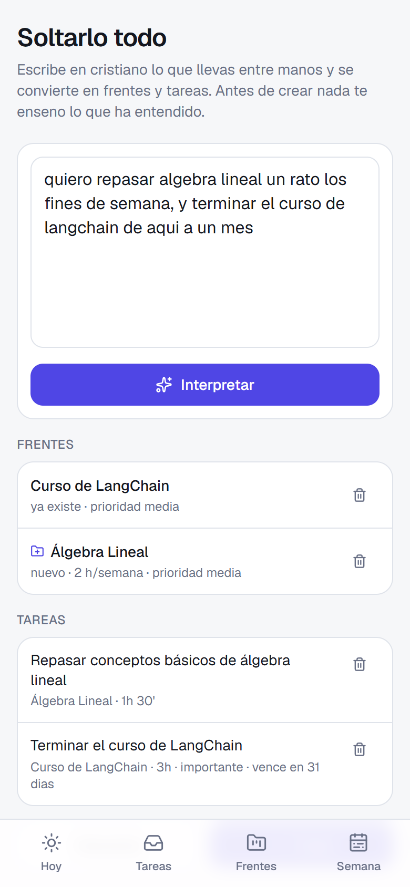
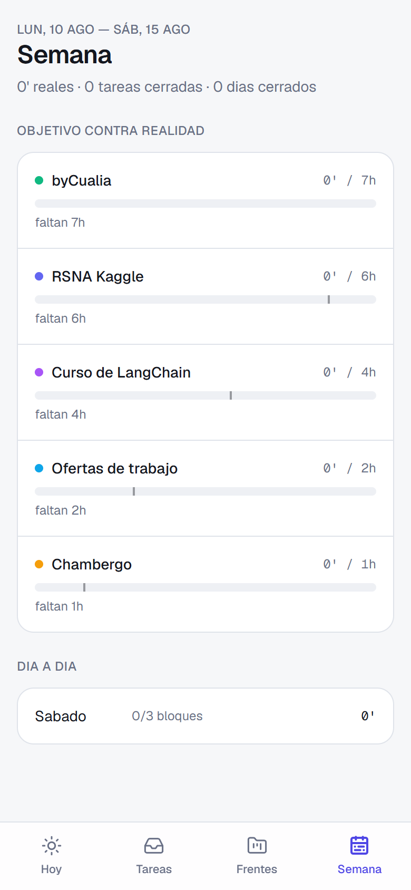

# Rumbo

Sistema de organización diaria. **2 minutos por la mañana, 1 por la noche.**

Tú sueltas tareas en la bandeja y dices cuántas horas quieres dedicarle a cada frente por
semana. Cada mañana el sistema decide qué toca hoy, te lo manda al móvil y tú solo vas
marcando. Al cerrar el día, lo que no hiciste alimenta el plan de mañana.

| Hoy | Captura por texto | Semana |
|:--:|:--:|:--:|
|  |  |  |
| El plan del día, con el motivo de cada bloque | Escribes en cristiano; confirmas antes de crear | Lo que dijiste que harías contra lo que hiciste |

## Cómo decide qué toca hoy

No hay magia ni LLM en el plan diario: es un motor de reglas determinista
([lib/planner.ts](lib/planner.ts)) que puntúa cada tarea pendiente.

| Factor | Peso máximo |
|---|---|
| Urgencia del deadline | 45 (vencida) / 40 |
| Importancia | 30 |
| Deuda de horas del frente esta semana | 25 |
| Veces que la has aplazado | 24 |
| Prioridad del frente | 15 |
| Penalización por repetir frente el mismo día | −15 por bloque |

Después rellena el día con estas reglas:

- Solo se planifica el **80 %** del tiempo que declaras. El 20 % restante es colchón.
- El **primer bloque es el profundo**, hasta 90 minutos. Los siguientes, hasta 60.
- **Máximo 3 frentes** distintos al día.
- Si una tarea tiene subtareas, se planifican las hijas y nunca la madre.
- Cada bloque guarda **por qué** se eligió, y eso es lo que ves bajo el título.

Como es una función pura, está cubierta por tests: `npm run test`.

## Arrancar en local

```bash
npm install && npm run setup && npm run dev
```

El PIN de entrada lo eliges tú en `.env` (`APP_PIN`). Que el de local no sea el mismo que
el de producción: si son iguales, cualquier cosa que documentes sobre uno vale para el otro.

Comandos útiles:

| Comando | Qué hace |
|---|---|
| `npm run test` | Tests del motor de planificación |
| `npm run verificar` | Ejercita el bucle completo contra una BD desechable (solo con el `provider` en `sqlite`) |
| `npm run seed` | Vuelve a sembrar frentes y tareas (es idempotente) |
| `npm run iconos` | Regenera los iconos (pestaña, PWA y iPhone) |
| `npm run capturas` | Regenera las capturas de `docs/` (necesita el servidor levantado) |

## Base de datos

Postgres de Supabase, tanto en local como en producción. Hacen falta dos URLs porque
cumplen papeles distintos:

- `DATABASE_URL` → **pooler de transacción** (`:6543`, con `?pgbouncer=true`). Lo usa la app
  en caliente; es el que aguanta bien las conexiones efímeras de serverless.
- `DIRECT_URL` → **pooler de sesión** (`:5432`). Lo usa la CLI de Prisma para migraciones y
  seed, que necesitan una sesión de verdad. Prisma 7 ya no tiene `directUrl` en el schema,
  así que la preferencia se resuelve en [prisma.config.ts](prisma.config.ts).

Las dos salen del panel de Supabase: **Connect → ORM → Prisma**.

`lib/db.ts` elige el driver adapter según el esquema de la URL, así que el código serviría
igual sobre SQLite cambiando el `provider` del schema.

## Desplegar en Vercel

Subir el repo a GitHub e importarlo en [Vercel](https://vercel.com). Detecta Next.js solo;
lo único manual son las variables de entorno.

### Variables de entorno en Vercel

| Variable | Para qué |
|---|---|
| `DATABASE_URL` | Pooler de Supabase (`:6543`, con `?pgbouncer=true`) |
| `APP_PIN` | El PIN de entrada |
| `AUTH_SECRET` | Firma de la cookie de sesión (≥32 caracteres aleatorios) |
| `CRON_SECRET` | Vercel lo manda solo en la cabecera del cron |
| `APP_URL` | URL pública, para el botón del mensaje de Telegram |
| `TELEGRAM_BOT_TOKEN` | Token de @BotFather |
| `TELEGRAM_CHAT_ID` | Tu chat con el bot |
| `ANTHROPIC_API_KEY` | Opcional, capa de IA (Fase 3) |

Para las migraciones desde local hace falta además `DIRECT_URL` (puerto `:5432`).

## El recordatorio de las 9:30

[vercel.json](vercel.json) programa `/api/cron/plan`, que genera el plan y lo manda por
Telegram con un botón para abrir la app.

Para sacar el `TELEGRAM_CHAT_ID`: mándale un mensaje cualquiera al bot y luego

```bash
curl "https://api.telegram.org/bot<TOKEN>/getUpdates"
```

El id sale en `result[0].message.chat.id`.

Probar el envío a mano:

```bash
curl -H "Authorization: Bearer $CRON_SECRET" https://<app>.vercel.app/api/cron/plan
```

> **Ojo con la hora.** Vercel programa los cron en UTC y el plan Hobby solo permite
> frecuencia diaria. `30 7 * * *` son las 09:30 en horario de verano y las 08:30 en
> invierno. Al cambiar la hora, en octubre, pasarlo a `30 8 * * *`.

El cron no es imprescindible: `ensureDayPlan()` es idempotente y la pantalla Hoy la llama
al entrar, así que si el cron falla el plan se genera igual cuando abres la app.

## Captura por texto

Escribes en cristiano lo que llevas entre manos y sale convertido en frentes y tareas, con
sus horas semanales, estimaciones y plazos. Entiende cosas como «al menos una hora al día»
(7 h/semana) o «de aquí a un mes» (fecha absoluta), y reutiliza los frentes que ya existen
en vez de duplicarlos.

Funciona en dos sitios, y en los dos **enseña primero lo que ha entendido y no crea nada
hasta que lo confirmas**:

- **Web**: `/capturar`, con enlace desde la pantalla de Tareas.
- **Telegram**: le escribes al bot y contesta con botones de Crear / Descartar.

Se activa sola si hay `GEMINI_API_KEY` (gratis) u `OPENAI_API_KEY`. Sin ninguna de las dos,
la pantalla lo dice y el resto de la app sigue funcionando igual.

Nada de lo que devuelve el modelo se cree a pies juntillas: `lib/borrador.ts` recorta
títulos, acota estimaciones, valida fechas y pone techo a cuántas cosas puede crear de
golpe. Está cubierto por tests.

Probar la interpretación desde la terminal, sin escribir en la base de datos:

```bash
npm run captura -- "el curso de langchain, algunos dias si y otros no, para dentro de un mes"
```

### Registrar el webhook de Telegram

Una sola vez, y de nuevo si cambia el dominio o el secreto:

```bash
npm run telegram:webhook
```

Usa `APP_URL` y `TELEGRAM_WEBHOOK_SECRET`. Con `-- estado` se consulta cómo está y con
`-- borrar` se quita. El webhook no pasa por la cookie de sesión: se autentica con la
cabecera `X-Telegram-Bot-Api-Secret-Token` y solo atiende al chat autorizado.

## Pendiente

- **Desglosar** una tarea grande en subtareas con IA (a mano ya se puede).
- **Replanificar hablando** («hoy estoy reventado» → el día se rehace con lo ligero).
- **Revisión semanal**: patrones de aplazamiento y si tus estimaciones son fantasía.

## Estructura

```
app/
  page.tsx           Hoy
  tareas/            bandeja de entrada
  proyectos/         frentes y objetivos semanales
  semana/            objetivo contra realidad
  actions.ts         todas las mutaciones (server actions)
  api/cron/plan/     el disparo de las 7:30
lib/
  planner.ts         el motor de reglas (puro, testeado)
  day.ts             ensureDayPlan y consultas agregadas
  date.ts            fechas "YYYY-MM-DD" en Europe/Madrid
  telegram.ts        composición y envío del mensaje
  auth.ts            PIN + cookie firmada
```
